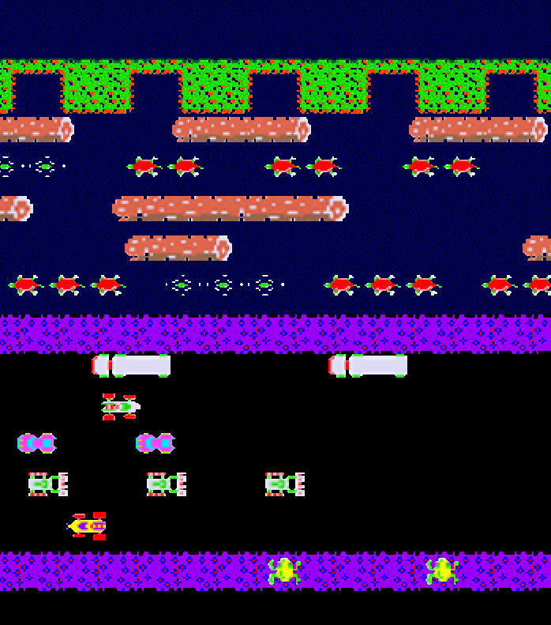

# NEAT-Neural-Net-Frogger
Everyone loves the classic game Frogger, right? Well, we created a Neural Net implemented with NEAT (NeuroEvolution of Augmenting Topologies) genetic algorithm to play the game, starting from square 1

Video - https://youtu.be/8g5fjMBPA_M

DevPost - https://devpost.com/software/neat-neural-net-frogger

## Inspiration
Frogger is a classic and beloved arcade game that is known by everyone. We wanted to see if we could apply machine learning techniques so that a computer could beat the Frogger by itself. So, we utilized neural networks, more specifically the NEAT algorithm, to learn how to play Frogger.

## What it Does
Our project trains a neural network using the NEAT algorithm to play Frogger. The NEAT algorithm aims to mimic how humans evolve in nature. Ideal behavior is passed down to future generations with mutations to allow them to continuously evolve. Throughout this process, the AI will constantly improve while searching for optimal behavior.

## Built With
This project was built with Python, NumPy, and PyGame.

## Future Plans
A next step would include deploying the neural network with Frogger so that a download would not be necessary in order to see it play. Additionally, we can continue to further fine-tune the hyperparameters so that the model learns how to play faster.

## Authors
- Jaewook Lee
- Arnold Makarov
- Jacob Maxson
